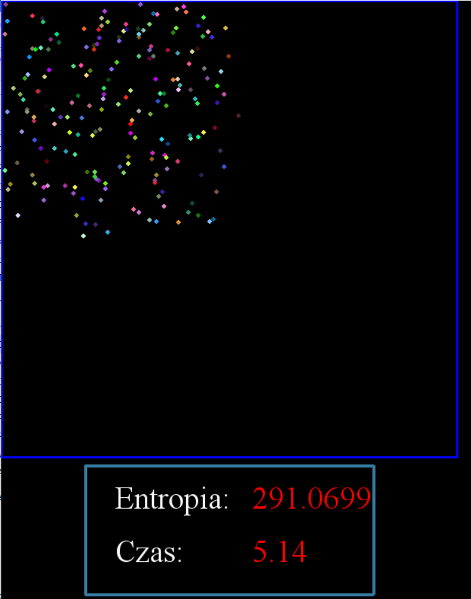

# Simulation of entropy

### General info
The N-number of particles of gas fill the two-dimensional space. Program shows the reaction between participles after collision, counts the entropy and draws the entropy-time graph .
This project was made for Physics classes
### Screenshots

### Technologies
* Python 3.0
* NumPy
* PyGame

#### Created by 
Klaudyna Samelak
Agata Bączkiewicz
Szymon Dzięgielewski
